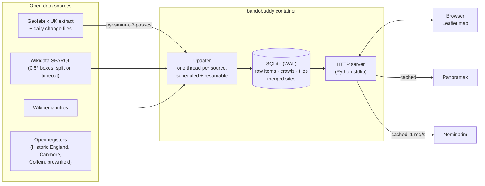

# bandobuddy

[](https://github.com/aidenharwood/portfolio-python-bandobuddy/actions/workflows/deploy.yaml)

An open-data map of likely-abandoned places across the UK, for urban explorers.

bandobuddy builds its own database of the whole country from **OpenStreetMap**, **Wikidata/Wikipedia** and the UK's **open national registers**. It works out what each place was and what state it's in, and keeps the data current in the background. The results appear on a phone-friendly map with category icons, the evidence in plain English, open street-level photos, directions, and GPS exports. It uses no proprietary APIs, needs no keys, and costs nothing to run.

## Features

- **Whole-UK coverage.** Reads the full Geofabrik UK extract (~2.3 GB) locally with pyosmium, the UK's Wikidata entries, and the open registers below.
- **Evidence, not scores.** Uses OpenStreetMap lifecycle tags (`abandoned:*`, `disused:*`, ruins, old mines, bunkers, dead railway tunnels), Wikidata state-of-use and closure dates, and wording in Wikipedia intros ("disused", "demolished", "converted to flats").
- **Stays up to date.** Scheduled refreshes apply OpenStreetMap's daily change files instead of downloading the country again. Places are flagged **NEW** when they appear and dropped when they disappear from the data.
- **Resumable.** Crawls survive restarts: downloads resume, and the Wikidata crawl remembers which areas are finished.
- **Made for phones.** A full-screen map with a draggable bottom sheet (a side panel on wider screens). It asks for your location when it opens (or tap the locate button later) to show where you are and list places nearest first, then get directions or share a link to a place.
- **Live map.** Built with Leaflet and OpenStreetMap tiles, with category icons that group into counts when zoomed out and fill in while an update runs. It also has category and source filters, place search (via Nominatim), [Panoramax](https://panoramax.fr) photos, and CSV/KML/GPX exports.
- **Two modes.** A personal mode with full update controls, and a read-only public mode for hosting.

## Architecture



Some implementation details:

- **Three-pass PBF read.** Tagged objects first, then the member ways of matching relations, then only the nodes those ways need. This places every way and relation without a multi-GB node-location index.
- **Adaptive Wikidata crawl.** The UK is covered in half-degree boxes. Any box that times out or truncates its results is split into four, and the split layout is reused next time.
- **Merging.** OSM elements and Wikidata items are merged into sites using a spatial grid, distance limits and name similarity. Sites are rebuilt from the raw items after every step, so changing the scoring rules never needs a re-crawl.
- **Hardened web server.** It checks every request's Host header against an allow-list (protecting local copies from DNS rebinding) and only accepts same-origin JSON on POST requests. On SIGTERM it pauses any running update so the next container carries on.
- **Tests.** An offline suite uses fakes for every upstream service, plus a hand-written OSM file read by the real pyosmium.

## Run it with Docker

```bash
docker compose up -d
```

Then open <http://localhost:8642>. On first start it builds the UK database in the background:

- **Wikidata:** about 30–60 minutes, with areas appearing on the map as they arrive.
- **OpenStreetMap:** a one-off 2.3 GB download, then 10–20 minutes to read it.

The data lives in the `bandobuddy-data` volume, so it survives rebuilds. Without Compose:

```bash
docker build -t bandobuddy .
docker run -d --name bandobuddy -p 8642:8642 -v bandobuddy-data:/data bandobuddy

# one-off jobs in the same image
docker run --rm -v bandobuddy-data:/data bandobuddy update --source wikidata
docker run --rm -v bandobuddy-data:/data -v "$PWD:/out" bandobuddy \
  export --near 51.34,-2.25 --radius 5 --format gpx -o /out/bradford.gpx

# run the tests inside the image
docker build --target test .
```

### Configuration

| Variable | Default (in the image) | Meaning |
|---|---|---|
| `BANDOBUDDY_DATA` | `/data` | Where the database and OSM extract are kept |
| `BANDOBUDDY_HOST` / `BANDOBUDDY_PORT` | `0.0.0.0` / `8642` | Listen address |
| `BANDOBUDDY_PUBLIC` | off | Read-only mode for visitors: update and settings controls are hidden and refused |
| `BANDOBUDDY_ALLOWED_HOSTS` | *(none)* | Comma-separated public hostnames the site is served on, e.g. `bandobuddy.example.org` (IP addresses and local names are always allowed) |
| `BANDOBUDDY_NO_AUTO_UPDATE` | off | Don't refresh the data on a schedule |

The refresh interval (7 days by default) is set in the app's **Data** panel, or with `bandobuddy update` from any scheduler. `/healthz` returns `{"ok": true, ...}` for container and Kubernetes health checks.

## Deploying to the portfolio cluster

This follows the same GitOps flow as the other portfolio apps. A push to `main` runs the tests, builds and pushes `ghcr.io/aidenharwood/portfolio/bandobuddy:<run>` using the shared build action, then updates the image tag in `portfolio-helm-website`, and Argo CD syncs it.

One-off setup:

1. Copy `deploy/k8s/templates/bandobuddy/` into `portfolio-helm-website/templates/bandobuddy/`. It contains a Deployment in read-only public mode with probes, a 15 Gi `local-path` disk claim, a Service and a Traefik Ingress for `bandobuddy.aidenharwood.uk`.
2. Point DNS for `bandobuddy.aidenharwood.uk` at the cluster, the same way as the other subdomains.
3. Add the `GHCR_USERNAME`, `GHCR_PAT` and `GH_PAT` secrets to this repository.
4. After the first build, make the `portfolio/bandobuddy` package public on GHCR, or give the cluster a pull secret.

The Deployment runs a single replica with the `Recreate` strategy, because SQLite and the extract must only ever be written by one pod.

## Run it without Docker

Needs Python 3.9 or newer. On Windows, double-click `run.bat`. Anywhere else:

```bash
pip install -r requirements.txt
python -m bandobuddy          # opens http://127.0.0.1:8642 here, and serves your network
```

### On your phone

bandobuddy is open to every device on your network, so a phone on the same Wi-Fi can use it too. It prints
the address to type in when it starts, e.g. `http://192.168.1.20:8642/`. That works for Docker too. To keep it to
this computer only, use `--host 127.0.0.1` (or `127.0.0.1:8642:8642` in `docker-compose.yml`). Add `--public` to
make it read-only for everyone.

It answers requests addressed to an IP address, a machine name or a home-network name (`.local`, `.lan`,
`.home.arpa`…). Public domain names need `--allowed-host`, which stops websites using DNS-rebinding tricks to
reach it.

### Install it as an app

bandobuddy is a progressive web app, so it installs from the browser without a store. On Android, Chrome offers
**Install** (there's a button in the menu too); on iPhone it's **Share → Add to Home Screen**. It then opens full
screen with its own icon.

Once installed it keeps working where the signal doesn't:

- the page, its icons and Leaflet are cached, so it opens with no connection at all
- map tiles you've already looked at are kept (capped at 600, and only ever tiles you actually viewed)
- places you've looked at are kept, so the nearby list and a shared link still open offline; move somewhere
  you haven't loaded and it shows the nearest view it does have, and says so
- the screen stays awake while you're following your location, and sleeps as soon as you stop

Updates and settings still need a connection, and the app tells you when you're offline. A new release retires the
old caches automatically, because the service worker is stamped with the version.

Phones only share their location with HTTPS sites, so the locate button won't work at a plain `http://192.168…`
address. To try location locally, use Chrome's USB port forwarding (`chrome://inspect/#devices` → *Port forwarding*,
`8642` → `localhost:8642`) and open `http://localhost:8642` on the phone, or use the HTTPS deployment.

On Windows, if other devices can't connect, allow Python through Windows Firewall for private networks and check the
Wi-Fi is set to a *Private* network.

## Where the places come from

| Source | Covers | Licence | What it brings |
|---|---|---|---|
| [OpenStreetMap](https://www.openstreetmap.org/copyright) | UK | ODbL | Lifecycle tags (`abandoned:*`, `disused:*`, ruins), old mines, bunkers, dead railway tunnels |
| [Wikidata / Wikipedia](https://www.wikidata.org) | UK | CC0 / CC BY-SA | State of use, closure dates, and what the article says about a place |
| [Heritage at Risk](https://opendata-historicengland.hub.arcgis.com/) (Historic England) | England | OGL v3 | Listed buildings and scheduled monuments recorded as at risk |
| [Canmore](https://canmore.org.uk/) (Historic Environment Scotland) | Scotland | OGL v3 | Observation posts, pillboxes, collieries, quarries, mills and the rest of the national record |
| [Coflein](https://coflein.gov.uk/) (RCAHMW) | Wales | OGL v2 | The same for the National Monuments Record of Wales |
| [Brownfield registers](https://www.planning.data.gov.uk/dataset/brownfield-land) | England | OGL v3 | Vacant and derelict land councils have registered |

A national register saying a place exists isn't the same as saying it's abandoned, so most register
entries are weak leads. Military and underground records are the exception: an observation post or a
colliery shaft is disused by definition. Entries that land on top of a place already on the map join it
rather than doubling it up, and each place links back to the register that listed it.

Every register is fetched with its own updater, so one being slow or down never blocks the others, and
each can be refreshed or paused on its own from the **Data** panel.

### Mining overlays

The Mining Remediation Authority's record of **175,000 mine entries** (shafts and adits), past shallow coal
workings and surface mining is published as a map service rather than as data, so those can't be listed or
searched as places. They can be drawn on the map instead: switch them on under *Mining overlays* in the
filters. Coal mining data © Mining Remediation Authority, under the Open Government Licence.

Actual mine and quarry *places* still come from OpenStreetMap, Canmore and Coflein, which do publish
their records as data.

### Bring your own records

Not everything worth knowing is open data. The [Defence of Britain archive](https://archaeologydataservice.ac.uk/archives/view/dob/download.cfm)
(about 20,000 20th-century military sites, Royal Observer Corps monitoring posts among them) is a one-off
download rather than a service, and your own notes are your own. Import a file and those places join the map
like any other source:

```bash
bandobuddy import defence-of-britain.kmz          # CSV, GPX, GeoJSON, KML or KMZ
bandobuddy import my-spots.csv --label scouting   # name the set yourself
bandobuddy import --list                          # what's loaded
bandobuddy import --forget scouting               # take a set back out
```

CSV columns are matched by the usual names (`name`/`title`, `lat`/`latitude`, `lng`/`lon`/`longitude`, plus
optional `type`, `notes` and `url`). Records are read the same way as a register: an entry that says
"ROC monitoring post" is military, one that says "colliery" is underground. Imported places stay in your
copy of the database - bandobuddy never fetches or publishes them - so whatever licence came with them is
between you and whoever compiled it.

## How places are described

Each place gets an **icon for what it was** (military, mines and tunnels, railways, industrial, churches, hospitals
and schools, shops and leisure, ruins and castles, houses) and a **condition** taken from its strongest evidence:
*Abandoned*, *Ruin*, *Disused*, *Closed 1987*, *Old workings*, *Old military*, *Former*, *Reused*, and so on. The
evidence itself is shown in plain English, e.g. "OpenStreetMap lists it as a disused hospital" or "Wikipedia
describes it as disused".

Behind the scenes the evidence is weighed to decide which places are worth showing:

| Evidence | Source | Weight |
|---|---|---|
| Tagged abandoned, a ruined building, or an abandoned railway tunnel | OpenStreetMap | strong |
| Tagged disused, an old mine entrance/shaft/quarry, a bunker or pillbox, a former station, or described as "derelict" | OpenStreetMap | medium |
| A closed shop or pub mapped as a single point, or a cave entrance | OpenStreetMap | weak |
| Heritage ruins open to visitors, or brownfield land | OpenStreetMap | weak |
| Marked abandoned/disused/decommissioned, an old mine/quarry/tunnel, or closed on a known date | Wikidata | medium (less if OSM already has it) |
| The Wikipedia intro says disused (up), has a new use or is still in use (down), or was demolished (removed) | Wikipedia | adjusts |
| "Former", "derelict"… in the name, or an explorable building type | Name, type | small boost |

Places with only weak evidence are **weaker leads**: hidden unless you turn on *Show weaker leads* in the filters
(or pass `--include-weak` to `bandobuddy export`). Stronger places win when the map is zoomed out, and are marked
*Strong evidence*.

## Data and credits

- Places come from © [OpenStreetMap](https://www.openstreetmap.org/copyright) contributors (ODbL), [Wikidata](https://www.wikidata.org) (CC0) and [Wikipedia](https://en.wikipedia.org) (CC BY-SA).
- Photos come from [Panoramax](https://panoramax.fr) (CC BY-SA). Search uses [Nominatim](https://nominatim.org).
- Map tiles come from OpenStreetMap and OpenTopoMap, plus Esri imagery (free to use, not open data).
- The app queries these community services politely: one Wikidata query at a time with pauses, Nominatim at most once a second, and repeat look-ups cached.

## Limitations

- **Only as good as the open data.** A site nobody has tagged or described won't appear. Local registries and urbex forums know far more, but aren't open data.
- **Closed high-street units** from OpenStreetMap can be noise, so they're hidden as weaker leads unless you turn them on.
- **Busy upstream services.** Wikidata can be busy; the crawl pauses and resumes rather than failing.

## Development

```bash
python -m unittest discover -s tests -t .
```

Layout:

- `bandobuddy/osm.py` · `extract.py`: reading and updating the OpenStreetMap extract
- `bandobuddy/wikidata.py`: the Wikidata crawl and Wikipedia intros
- `bandobuddy/sites.py` · `scoring.py`: merging and scoring
- `bandobuddy/updater.py`: scheduled, resumable updates
- `bandobuddy/store.py`: SQLite
- `bandobuddy/webapp.py` · `app.html`: the server and map UI

## Be sensible

A place being on this map doesn't mean you can go in. Check who owns it, stay off anything posted or secured, and don't go alone.
