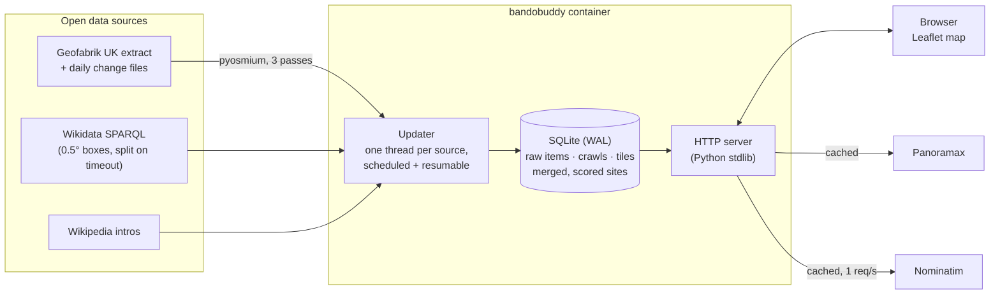

# bandobuddy

[](https://github.com/aidenharwood/portfolio-python-bandobuddy/actions/workflows/deploy.yaml)

An open-data map of likely-abandoned places across the UK, for urban explorers.

bandobuddy builds its own database of the whole country from **OpenStreetMap** and **Wikidata/Wikipedia**. It scores every candidate on how likely it is to be derelict and keeps the data current in the background. The results appear on a map with filters, the evidence behind each score, open street-level photos, and GPS exports. It uses no proprietary APIs, needs no keys, and costs nothing to run.

## Features

- **Whole-UK coverage.** Reads the full Geofabrik UK extract (~2.3 GB) locally with pyosmium, plus the UK's Wikidata entries.
- **Scored evidence.** Uses OpenStreetMap lifecycle tags (`abandoned:*`, `disused:*`, ruins, old mines, bunkers, dead railway tunnels), Wikidata state-of-use and closure dates, and wording in Wikipedia intros ("disused", "demolished", "converted to flats").
- **Stays up to date.** Scheduled refreshes apply OpenStreetMap's daily change files instead of downloading the country again. Places are flagged **NEW** when they appear and dropped when they disappear from the data.
- **Resumable.** Crawls survive restarts: downloads resume, and the Wikidata crawl remembers which areas are finished.
- **Live map.** Built with Leaflet and OpenStreetMap tiles, with pins filling in while an update runs. It also has category, score and source filters, place search (via Nominatim), [Panoramax](https://panoramax.fr) photos, and CSV/KML/GPX exports.
- **Two modes.** A personal mode with full update controls, and a read-only public mode for hosting.

## Architecture



Some implementation details:

- **Three-pass PBF read.** Tagged objects first, then the member ways of matching relations, then only the nodes those ways need. This places every way and relation without a multi-GB node-location index.
- **Adaptive Wikidata crawl.** The UK is covered in half-degree boxes. Any box that times out or truncates its results is split into four, and the split layout is reused next time.
- **Merging.** OSM elements and Wikidata items are merged into sites using a spatial grid, distance limits and name similarity. Sites are rebuilt from the raw items after every step, so changing the scoring rules never needs a re-crawl.
- **Hardened web server.** It checks every request's Host header against an allow-list (protecting local copies from DNS rebinding) and only accepts same-origin JSON on POST requests. On SIGTERM it pauses any running update so the next container carries on.
- **Tests.** An offline suite uses fakes for every upstream service, plus a hand-written OSM file read by the real pyosmium.

## Run it with Docker

```bash
docker compose up -d
```

Then open <http://localhost:8642>. On first start it builds the UK database in the background:

- **Wikidata:** about 30–60 minutes, with areas appearing on the map as they arrive.
- **OpenStreetMap:** a one-off 2.3 GB download, then 10–20 minutes to read it.

The data lives in the `bandobuddy-data` volume, so it survives rebuilds. Without Compose:

```bash
docker build -t bandobuddy .
docker run -d --name bandobuddy -p 127.0.0.1:8642:8642 -v bandobuddy-data:/data bandobuddy

# one-off jobs in the same image
docker run --rm -v bandobuddy-data:/data bandobuddy update --source wikidata
docker run --rm -v bandobuddy-data:/data -v "$PWD:/out" bandobuddy \
  export --near 51.34,-2.25 --radius 5 --format gpx -o /out/bradford.gpx

# run the tests inside the image
docker build --target test .
```

### Configuration

| Variable | Default (in the image) | Meaning |
|---|---|---|
| `BANDOBUDDY_DATA` | `/data` | Where the database and OSM extract are kept |
| `BANDOBUDDY_HOST` / `BANDOBUDDY_PORT` | `0.0.0.0` / `8642` | Listen address |
| `BANDOBUDDY_PUBLIC` | off | Read-only mode for visitors: update and settings controls are hidden and refused |
| `BANDOBUDDY_ALLOWED_HOSTS` | *(none)* | Comma-separated hostnames the site is served on, e.g. `bandobuddy.example.org` (localhost is always allowed) |
| `BANDOBUDDY_NO_AUTO_UPDATE` | off | Don't refresh the data on a schedule |

The refresh interval (7 days by default) is set in the app's **Data** panel, or with `bandobuddy update` from any scheduler. `/healthz` returns `{"ok": true, ...}` for container and Kubernetes health checks.

## Deploying to the portfolio cluster

This follows the same GitOps flow as the other portfolio apps. A push to `main` runs the tests, builds and pushes `ghcr.io/aidenharwood/portfolio/bandobuddy:<run>` using the shared build action, then updates the image tag in `portfolio-helm-website`, and Argo CD syncs it.

One-off setup:

1. Copy `deploy/k8s/templates/bandobuddy/` into `portfolio-helm-website/templates/bandobuddy/`. It contains a Deployment in read-only public mode with probes, a 15 Gi `local-path` disk claim, a Service and a Traefik Ingress for `bandobuddy.aidenharwood.uk`.
2. Point DNS for `bandobuddy.aidenharwood.uk` at the cluster, the same way as the other subdomains.
3. Add the `GHCR_USERNAME`, `GHCR_PAT` and `GH_PAT` secrets to this repository.
4. After the first build, make the `portfolio/bandobuddy` package public on GHCR, or give the cluster a pull secret.

The Deployment runs a single replica with the `Recreate` strategy, because SQLite and the extract must only ever be written by one pod.

## Run it without Docker

Needs Python 3.9 or newer. On Windows, double-click `run.bat`. Anywhere else:

```bash
pip install -r requirements.txt
python -m bandobuddy          # opens http://127.0.0.1:8642 in your browser
```

## How places are scored

| Signal | Source | Points |
|---|---|---|
| Tagged abandoned, a ruined building, or an abandoned railway tunnel | OpenStreetMap | +35 |
| Tagged disused, an old mine entrance/shaft/quarry, a bunker or pillbox, a former station, or described as "derelict" | OpenStreetMap | +25 |
| A closed shop or pub mapped as a single point, or a cave entrance | OpenStreetMap | +15 |
| Heritage ruins open to visitors, or brownfield land | OpenStreetMap | +10 |
| Marked abandoned/disused/decommissioned, an old mine/quarry/tunnel, or closed on a known date | Wikidata | +10 to +30 (half if OSM already has it) |
| The Wikipedia intro says disused (+15), has a new use (−15), still in use (−20), or demolished (removed) | Wikipedia | ± |
| "Former", "derelict"… in the name / an explorable building type | Name, type | +15 / +10 |

Scores are capped at 0 to 100 and grouped into tiers: **prime** (60+), **likely** (35+), **maybe** (15+) and **long shot**.

## Data and credits

- Places come from © [OpenStreetMap](https://www.openstreetmap.org/copyright) contributors (ODbL), [Wikidata](https://www.wikidata.org) (CC0) and [Wikipedia](https://en.wikipedia.org) (CC BY-SA).
- Photos come from [Panoramax](https://panoramax.fr) (CC BY-SA). Search uses [Nominatim](https://nominatim.org).
- Map tiles come from OpenStreetMap and OpenTopoMap, plus Esri imagery (free to use, not open data).
- The app queries these community services politely: one Wikidata query at a time with pauses, Nominatim at most once a second, and repeat look-ups cached.

## Limitations

- **Only as good as the open data.** A site nobody has tagged or described won't appear. Local registries and urbex forums know far more, but aren't open data.
- **Closed high-street units** from OpenStreetMap can be noise. Filter by category or raise the minimum score.
- **Busy upstream services.** Wikidata can be busy; the crawl pauses and resumes rather than failing.

## Development

```bash
python -m unittest discover -s tests -t .
```

Layout:

- `bandobuddy/osm.py` · `extract.py`: reading and updating the OpenStreetMap extract
- `bandobuddy/wikidata.py`: the Wikidata crawl and Wikipedia intros
- `bandobuddy/sites.py` · `scoring.py`: merging and scoring
- `bandobuddy/updater.py`: scheduled, resumable updates
- `bandobuddy/store.py`: SQLite
- `bandobuddy/webapp.py` · `app.html`: the server and map UI

## Be sensible

A place being on this map doesn't mean you can go in. Check who owns it, stay off anything posted or secured, and don't go alone.
