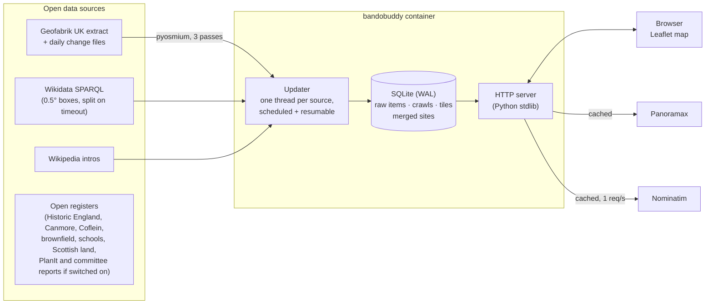

# bandobuddy

[](https://github.com/aidenharwood/portfolio-python-bandobuddy/actions/workflows/deploy.yaml)

An open-data map of likely-abandoned places across the UK, for urban explorers.

bandobuddy builds its own database of the whole country from **OpenStreetMap**, **Wikidata/Wikipedia** and the UK's **open national registers**. It works out what each place was and what state it's in, and keeps the data current in the background. The results appear on a phone-friendly map with category icons, the evidence in plain English, open street-level photos, directions, and GPS exports. It uses no proprietary APIs, needs no keys, and costs nothing to run.

## Features

- **Whole-UK coverage.** Reads the full Geofabrik UK extract (~2.3 GB) locally with pyosmium, the UK's Wikidata entries, and the open registers below.
- **Evidence, not scores.** Uses OpenStreetMap lifecycle tags (`abandoned:*`, `disused:*`, ruins, old mines, bunkers, dead railway tunnels), Wikidata state-of-use and closure dates, and wording in Wikipedia intros ("disused", "demolished", "converted to flats").
- **Stays up to date.** Scheduled refreshes apply OpenStreetMap's daily change files instead of downloading the country again. Places are flagged **NEW** when they appear and dropped when they disappear from the data.
- **Resumable.** Crawls survive restarts: downloads resume, and the Wikidata crawl remembers which areas are finished.
- **Made for phones.** A full-screen map with a draggable bottom sheet (a side panel on wider screens). It asks for your location when it opens (or tap the location button later) to show where you are and list places nearest first, then get directions or share a link to a place. Your position is an arrow pointing the way you're facing, from the phone's compass (an iPhone asks first, from a tap of the location button), or the way you're heading while you're on the move; a dot when it can't tell. The location button always brings the map back to you; the floating layers button beside it holds the map style and the overlays.
- **Live map.** Built with Leaflet and OpenStreetMap tiles, with category icons that group into counts when zoomed out and fill in while an update runs. It also has category and source filters, place search (via Nominatim), [Panoramax](https://panoramax.fr) photos, and CSV/KML/GPX exports.
- **Somewhere to start digging.** Each place lists the records it was built from, each linked to its page at the source: the OpenStreetMap object and its edit history, Wikidata and Wikipedia, the register entry, Historic England's official list entry, the planning application. The source's licence sits beside it. A *Dig deeper* list opens the same spot elsewhere: Ordnance Survey maps of 1888–1915 (National Library of Scotland), satellite imagery since 2014 (Esri Wayback), England's planning and listings map, Geograph and Mapillary photos, Wikipedia nearby, web and explorer-forum searches, the land registry for who owns it, and an OpenStreetMap note for reporting it gone. The grid reference the registers and old maps use is there to copy.
- **Two modes.** A personal mode with full update controls, and a read-only public mode for hosting.

## Architecture


```mermaid
flowchart LR
  subgraph Sources["Open data sources"]
    GF["Geofabrik UK extract<br/>+ daily change files"]
    WD["Wikidata SPARQL<br/>(0.5° boxes, split on timeout)"]
    WP["Wikipedia intros"]
    OD["Open registers<br/>(Historic England, Canmore, Coflein,<br/>brownfield, schools, Scottish land,<br/>PlanIt and committee reports if switched on)"]
  end
  subgraph App["bandobuddy container"]
    UP["Updater<br/>one thread per source,<br/>scheduled + resumable"]
    DB[("SQLite (WAL)<br/>raw items · crawls · tiles<br/>merged sites")]
    WEB["HTTP server<br/>(Python stdlib)"]
  end
  UI["Browser<br/>Leaflet map"]
  PX["Panoramax"]
  NM["Nominatim"]
  GF -->|pyosmium, 3 passes| UP
  WD --> UP
  WP --> UP
  UP --> DB
  DB --> WEB
  WEB <--> UI
  WEB -->|cached| PX
  WEB -->|cached, 1 req/s| NM
```

Some implementation details:

- **Three-pass PBF read.** Tagged objects first, then the member ways of matching relations, then only the nodes those ways need. This places every way and relation without a multi-GB node-location index. The nodes those outlines use (millions, for the UK) are held as a sorted array of ids with their positions in arrays alongside, about 24 bytes a node rather than the 200 a dictionary of tuples takes, so a whole-UK build fits comfortably in the container's memory.
- **Adaptive Wikidata crawl.** The UK is covered in half-degree boxes. Any box that times out or truncates its results is split into four, and the split layout is reused next time.
- **Merging.** OSM elements and Wikidata items are merged into sites using a spatial grid, distance limits and name similarity. Sites are rebuilt from the raw items after every step, so changing the scoring rules never needs a re-crawl.
- **Hardened web server.** It checks every request's Host header against an allow-list (protecting local copies from DNS rebinding) and only accepts same-origin JSON on POST requests. On SIGTERM it pauses any running update so the next container carries on.
- **Tests.** An offline suite uses fakes for every upstream service, plus a hand-written OSM file read by the real pyosmium.

## Run it with Docker

```bash
docker compose up -d
```

Then open <http://localhost:8642>. On first start it builds the UK database in the background:

- **Wikidata:** about 30–60 minutes, with areas appearing on the map as they arrive.
- **OpenStreetMap:** a one-off 2.3 GB download, then 10–20 minutes to read it.

The data lives in the `bandobuddy-data` volume, so it survives rebuilds. Without Compose:

```bash
docker build -t bandobuddy .
docker run -d --name bandobuddy -p 8642:8642 -v bandobuddy-data:/data bandobuddy

# one-off jobs in the same image
docker run --rm -v bandobuddy-data:/data bandobuddy update --source wikidata
docker run --rm -v bandobuddy-data:/data -v "$PWD:/out" bandobuddy \
  export --near 51.34,-2.25 --radius 5 --format gpx -o /out/bradford.gpx

# run the tests inside the image
docker build --target test .
```

### Configuration

| Variable | Default (in the image) | Meaning |
|---|---|---|
| `BANDOBUDDY_DATA` | `/data` | Where the database and OSM extract are kept |
| `BANDOBUDDY_HOST` / `BANDOBUDDY_PORT` | `0.0.0.0` / `8642` | Listen address |
| `BANDOBUDDY_PUBLIC` | off | Read-only mode for visitors: update and settings controls are hidden and refused |
| `BANDOBUDDY_ALLOWED_HOSTS` | *(none)* | Comma-separated public hostnames the site is served on, e.g. `bandobuddy.example.org` (IP addresses and local names are always allowed) |
| `BANDOBUDDY_NO_AUTO_UPDATE` | off | Don't refresh the data on a schedule |
| `BANDOBUDDY_PLANIT` | off (on in `run.bat`) | Also sweep UK PlanIt weekly for demolition applications (see below) |
| `BANDOBUDDY_COMMITTEES` | off (on in `run.bat`) | Also read councils' planning committee reports weekly (see below) |
| `BANDOBUDDY_NHS_ESTATES` | off | Also read NHS England's estates return for empty NHS sites (see below: its file host asks robots to stay away) |

The refresh interval (7 days by default) is set in the app's **Data** panel, or with `bandobuddy update` from any scheduler. `/healthz` returns `{"ok": true, ...}` for container and Kubernetes health checks.

## Deploying to the portfolio cluster

This follows the same GitOps flow as the other portfolio apps. A push to `main` runs the tests, builds and pushes `ghcr.io/aidenharwood/portfolio/bandobuddy:<run>` using the shared build action, then updates the image tag in `portfolio-helm-website`, and Argo CD syncs it.

One-off setup:

1. Copy `deploy/k8s/templates/bandobuddy/` into `portfolio-helm-website/templates/bandobuddy/`. It contains a Deployment in read-only public mode with probes (and the PlanIt and committee-report sources switched on), a 15 Gi `local-path` disk claim, a Service and a Traefik Ingress for `bandobuddy.aidenharwood.uk`.
2. Point DNS for `bandobuddy.aidenharwood.uk` at the cluster, the same way as the other subdomains.
3. Add the `GHCR_USERNAME`, `GHCR_PAT` and `GH_PAT` secrets to this repository.
4. After the first build, make the `portfolio/bandobuddy` package public on GHCR, or give the cluster a pull secret.

The Deployment runs a single replica with the `Recreate` strategy, because SQLite and the extract must only ever be written by one pod.

## Run it without Docker

Needs Python 3.9 or newer. On Windows, double-click `run.bat`. Anywhere else:

```bash
pip install -r requirements.txt
python -m bandobuddy          # opens http://127.0.0.1:8642 here, and serves your network
```

### On your phone

bandobuddy is open to every device on your network, so a phone on the same Wi-Fi can use it too. It prints
the address to type in when it starts, e.g. `http://192.168.1.20:8642/`. That works for Docker too. To keep it to
this computer only, use `--host 127.0.0.1` (or `127.0.0.1:8642:8642` in `docker-compose.yml`). Add `--public` to
make it read-only for everyone.

It answers requests addressed to an IP address, a machine name or a home-network name (`.local`, `.lan`,
`.home.arpa`…). Public domain names need `--allowed-host`, which stops websites using DNS-rebinding tricks to
reach it.

### Install it as an app

bandobuddy is a progressive web app, so it installs from the browser without a store. On Android, Chrome offers
**Install** (there's a button in the menu too); on iPhone it's **Share → Add to Home Screen**. It then opens full
screen with its own icon.

Open the installed app once with a signal. (On iPhone that has to be the home-screen app itself: it keeps its own
storage, separate from Safari's, so what Safari kept doesn't carry over.) From then on it keeps working where the
signal doesn't:

- the page, its icons and Leaflet are cached, so it opens with no connection at all
- **every place, in brief** (name, where, what it was, how strong the evidence is): about 3 MB for the whole UK,
  fetched once and again only when the map has changed. So the map, the list, filters and search work offline
  anywhere, including places you've never looked at. The service worker answers the app's own requests from
  this copy the same way the server would (same filters, clusters and order): first, whenever it matches the
  server's map (in about 10 ms, against a few hundred for asking the server); with no signal; and after six
  seconds on a signal too weak to answer. The server says when its map last changed, and a rebuild that comes out
  the same (a restart, or an update that found nothing) doesn't count, so the copy stays current until something
  does change. It's then fetched again, at most every ten minutes while an update keeps changing things
- **everything about the places where you zoom in** (the evidence, what each source says, the ways in, the
  links): once the map settles at about town level, the details are fetched quietly in squares of a quarter of
  a degree, two at a time and each square once a week, holding off on data saver or a slow connection. A place
  you open, and every place that's been in your list at any zoom, is kept in full too. **Keep everything** in the menu adds the full details of every place in the UK
  (about 25 MB to download, about 130 MB on the phone) and carries on where it stopped if the signal drops
- **every map tile you look at** (up to 40,000, about 1 GB), in each map style and the mining overlays. Zoom in
  further than you ever looked and the map fills in from the nearest zoomed-out tile you did see, blurrier but
  still there. Only tiles you've actually viewed: OpenStreetMap's tile policy rules out bulk-downloading them.
  For a full offline map, download your saved places as GPX and open them in OsmAnd or Organic Maps
- "Getting there", street photos and town or postcode searches, once you've used them. A place's page, "Getting
  there" and the photos open from what's kept straight away, and are refreshed behind the scenes for next time;
  so is the app itself, so it opens at once and a new version is used from the next opening
- the screen stays awake while you're following your location, and sleeps as soon as you stop

Tiles and photos are fetched with CORS, so the phone's storage counts them at their real size (browsers count
each "opaque" response as several megabytes). The menu shows what's kept and how much space it takes, and
**Clear** removes it (saved places and notes stay). The app asks the browser to keep this storage when the
phone runs low on space; whether it agrees is up to the browser.

Updates and settings still need a connection, and the app tells you when you're offline. A place whose details
weren't kept still opens with what the brief copy knows (its name, what it was, the main reason, Directions).
A new version only takes over once it has everything the app needs to open, so an update that half-downloads
on a weak signal can't leave you with nothing offline. A new release retires the old caches automatically,
because the service worker is stamped with the version.

Phones only share their location with HTTPS sites, so the locate button won't work at a plain `http://192.168…`
address. To try location locally, use Chrome's USB port forwarding (`chrome://inspect/#devices` → *Port forwarding*,
`8642` → `localhost:8642`) and open `http://localhost:8642` on the phone, or use the HTTPS deployment.

On Windows, if other devices can't connect, allow Python through Windows Firewall for private networks and check the
Wi-Fi is set to a *Private* network.

## Where the places come from

| Source | Covers | Licence | What it brings |
|---|---|---|---|
| [OpenStreetMap](https://www.openstreetmap.org/copyright) | UK | ODbL | Lifecycle tags (`abandoned:*`, `disused:*`, ruins), old mines, bunkers, dead railway tunnels |
| [Wikidata / Wikipedia](https://www.wikidata.org) | UK | CC0 / CC BY-SA | State of use, closure dates, barracks and airfields, and what the article says about a place |
| [Heritage at Risk](https://opendata-historicengland.hub.arcgis.com/) (Historic England) | England | OGL v3 | Listed buildings and scheduled monuments recorded as at risk |
| [Canmore](https://canmore.org.uk/) (Historic Environment Scotland) | Scotland | OGL v3 | Observation posts, pillboxes, collieries, quarries, mills and the rest of the national record |
| [Coflein](https://coflein.gov.uk/) (RCAHMW) | Wales | OGL v2 | The same for the National Monuments Record of Wales |
| [Brownfield registers](https://www.planning.data.gov.uk/dataset/brownfield-land) | England | OGL v3 | Vacant and derelict land councils have registered |
| [Get Information about Schools](https://www.get-information-schools.service.gov.uk/) (DfE) | England | OGL v3 | Schools that closed for good, and when |
| [Vacant and Derelict Land Survey](https://www.gov.scot/publications/the-scottish-vacant-and-derelict-land-survey-site-register/) | Scotland | OGL v3 | Derelict sites and empty buildings, what they used to be and since when |
| [Care Quality Commission](https://www.cqc.org.uk/about-us/transparency/using-cqc-data) closed locations | England | OGL v3 | Care homes and hospitals that closed, with nothing registered at the address since |
| [Historical Railways Estate](https://nationalhighways.co.uk/our-work/historical-railways-estate/about-the-hre/) (National Highways) | Great Britain | Published by National Highways | Tunnels and viaducts on railway lines closed long ago |
| [MOD disposals](https://www.gov.uk/government/publications/disposal-database-house-of-commons-report) | UK | OGL v3 | Barracks, airfields, ranges and depots the Ministry of Defence has given up or is giving up |
| [NHS estates return (ERIC)](https://digital.nhs.uk/data-and-information/publications/statistical/estates-returns-information-collection) (optional, off by default) | England | OGL v3 | NHS sites standing wholly or mostly empty |
| [UK PlanIt](https://www.planit.org.uk/) (optional, off by default) | UK | Planning register data | Applications to demolish buildings described as derelict, empty or redundant; applications that call a building derelict or falling down; houses begun and never finished |
| Planning committee reports (optional, off by default) | 195 councils | Council papers, mostly OGL | A planning officer's own sentence saying the building on a site stands empty, unfinished or derelict |

A national register saying a place exists isn't the same as saying it's abandoned, so most register
entries are weak leads. Military and underground records are the exception: an observation post or a
colliery shaft is disused by definition. Entries that land on top of a place already on the map join it
rather than doubling it up, and each place links back to the register that listed it.

Every register is fetched with its own updater, so one being slow or down never blocks the others, and
each can be refreshed or paused on its own from the **Data** panel.

**Closed schools.** The Department for Education's register lists every school in England, open or closed, in
one daily download (about 65 MB, read as it arrives rather than saved). A closed school only counts if it shut
for good: conversions to academies and changes of sponsor close a record but not the school, and anything with
an open school within 100 m is still a school. Infant and junior schools that closed on one site are one place,
named for the last to go. Recently closed schools are the ones most likely to be standing empty, so those closed
within five years are shown by default and older closures are weaker leads.

**Scotland's vacant and derelict land.** The Scottish Government's annual survey lists every vacant or derelict
site of 0.1 ha or more, with what it used to be and since when. Derelict sites and empty buildings are shown
(more so for old defence, mining, industrial, school, hospital and hotel sites); cleared vacant plots are weaker
leads. Owners aren't kept. The register's page asks that councils, who own the data, are asked before any use that
could infringe their copyright.

**Closed care homes and hospitals.** The Care Quality Commission publishes, monthly, every care home, hospital
and clinic it has stopped regulating (a 27 MB spreadsheet, read as it streams in), beside its directory of everything
registered now. A closure only counts if the building closed: a change of owner ends one registration and starts
another at the same address, so anything with a service registered there now is left out, and of several
registrations at one building only the last counts. Care homes with fewer than 20 beds, ordinary houses that go back
to being homes, are left out too. Recent closures are the strongest leads; a care home that closed more than twelve
years ago has usually been converted or knocked down, so it's a weak one. That's about 2,800 places. The files are
read again only when CQC publishes new ones.

**Closed railways' tunnels and viaducts.** National Highways looks after what's left of railway lines closed long
ago (the Historical Railways Estate) and publishes a list of the structures with grid references. Its tunnels and
viaducts are kept, about 150 and 90, but not the road bridges. Those on a line that's a cycle path now are weaker
leads. Many of the tunnels are sealed or partly filled in, and the list doesn't say which.

**The MOD's disposals.** The Ministry of Defence gives Parliament a list of the sites it's disposing of, each with the
year it's released: barracks, airfields, ranges, depots and officers' messes. The list has no positions, so each is
found by its name and town with Nominatim, a second apart, and only once. Bare land (fields, training areas, playing
fields) is left out. Sites already released are leads; those due to go in a later year are weak until then and show
as *Closing*. Wikidata's barracks and airfields are read too, as faint leads for their Wikipedia articles to settle.

**Empty NHS sites, optional.** NHS England's yearly estates return lists every NHS site with how much of it is
unoccupied. Sites reported as wholly unoccupied, and those where at least half the floor (and 1,000 m² or more)
stands empty, are placed by postcode: about 50, old ones built before 1948 counting for more. The file is on
files.digital.nhs.uk, whose robots.txt asks every robot to stay away, so it's off unless you set
`BANDOBUDDY_NHS_ESTATES=1` or run `bandobuddy update --source nhs_estates` yourself. That's one download a year.

**Planning applications (UK PlanIt), optional.** PlanIt gathers planning applications from council websites. It's
one person's free service and asks for no more than a request a minute, so bandobuddy asks only for applications to
demolish something described as derelict, dilapidated, disused, vacant, redundant, fire damaged, abandoned, unsafe,
empty or former, and for any application that calls the building itself derelict, dilapidated, ruinous, fire damaged
or abandoned (a derelict chapel up for conversion is still standing): those made in the last fortnight, then
decisions in the last fortnight on any made earlier. That's usually one page each, a minute apart (longer if PlanIt
asks to wait), and it runs weekly, building up a picture rather than copying the archive. Separately, it asks each
time for every application about a house begun and never finished, or never lived in ("partially built dwelling",
"never occupied"): about 120 since 2000, a single page. Derelict barns up for conversion, of which there are a great
many, and unfinished houses (most are self-builds that were finished later) are weaker leads; a description that
uses those words of a tree, the windows or a shed is ignored. Each application is saved as it arrives, so stopping part-way keeps what came.
Garages, extensions and house replacements are ignored, and so are pre-application advice and lawful-development
certificates, which don't decide anything. An approved demolition shows as the place's condition; one approved more
than 18 months ago, or a follow-up to an earlier approval (discharging its conditions, an amendment), is a weak lead
because the building has probably gone or is going. `run.bat` switches it on; anywhere else it's off unless you set
`BANDOBUDDY_PLANIT=1` (the Docker image leaves it off; the public site's Deployment sets it), or run it by hand with
`bandobuddy update --source planit`. A pilot sweep found 43 leads in a fortnight across the UK.

### Planning committee reports

Before a planning committee decides an application, an officer writes a report that describes the site, and says
plainly when the building on it stands empty, unfinished or falling down. Golden Hill, near Romsey "was built as a
substantial, single residence but has not been occupied since its construction in 2004"
([Test Valley, 22/00362/FULLS](https://testvalley.moderngov.co.uk/documents/s25119/22_00362_FULLS%20SAPC%20Report%202.pdf)).
No register records that; the report is the only place it's written down.

Most councils in England and Wales publish committee papers with ModernGov, which has a free-text search over every
document it holds. bandobuddy knows 195 councils whose ModernGov search answers (found by asking each of PlanIt's 455
planning authorities' likely ModernGov addresses, then searching each once; 33 more turn searches away and aren't
asked). For each, it asks for planning committee papers using the phrases officers use, such as "has not been occupied
since", "has stood empty", "vacant since", "has been redundant", "poor state of repair", "dilapidated", "boarded up",
"safety fencing" or "partially constructed dwelling", all in one search. It reads only the reports that match (a few hundred kilobytes each, with
[pypdf](https://pypi.org/project/pypdf/)), and keeps the sentence where the phrase is said of the site itself. A
sentence about a neighbour, about who may live there (agricultural ties, holiday lets), quoting a policy or a rule
("will only be permitted where... vacant for 12 months"), asked by a commenter, or saying the buildings have since
been demolished is passed over. Reports are laid out differently from council to council: some label the reference
("APPLICATION NO. 22/00362/FULLS"), others set it on a line of its own above the site and proposal. Where a report
gives the site's grid reference ("Map Ref (E) 480388 (N) 104217"), that places it to the metre; otherwise the place is
found from the site address (the house itself where OpenStreetMap knows it, else the middle of its postcode, from
[postcodes.io](https://postcodes.io)). Each links to the report, open at the page that says so. Burnes Shipyard in
Bosham came to light this way: OpenStreetMap only has its abandoned slipway, and its planning applications say no
more than "demolition of existing buildings", but Chichester's planning officer wrote that "the site has been
redundant for more than twenty years, with the buildings in a poor state of repair with the site enclosed with safety
fencing" (boat building until about 1990, car repairs until 1993).

The first run goes back to 2016, one search per planning committee. After that it asks for the last few weeks'
papers each week, one search per council. Councils are separate websites, so eight are asked at once, each a
request a second. Which reports it has read is kept in `committee_reports.json` in the data folder, so nothing is
read twice. A council that turns a request away is skipped until the next run. Reports more than five years old
count for less, and more than ten years old are weak leads, as the building may have been done up or knocked down
since. An empty shop unit or a cleared site is a weak
lead too. Pilots on a dozen councils' last few years of papers found a handful of places each time, among them
Derry's Ebrington Square listed buildings ("vacant since 2002, are in a poor state of repair") and 7/9 London Road,
Widley ("in a state of disrepair and has been unoccupied for some time"). `run.bat` and the public site's Deployment
switch it on; anywhere else set `BANDOBUDDY_COMMITTEES=1`, or run it by hand with
`bandobuddy update --source committees`.

### Mining overlays

The Mining Remediation Authority's record of **175,000 mine entries** (shafts and adits), past shallow coal
workings and surface mining is published as a map service rather than as data, so those can't be listed or
searched as places. They can be drawn on the map instead: switch them on with the layers button on the
map. Their pictures are only drawn down to zoom 14, and mine entries and surface mining only from zoom 13,
so zoomed in further the zoom-14 pictures are stretched, and zoomed out the app says to zoom in. Coal mining data © Mining Remediation Authority, under the Open Government Licence.

Actual mine and quarry *places* still come from OpenStreetMap, Canmore and Coflein, which do publish
their records as data.

### LiDAR relief

**LiDAR relief** (from the layers button on the map) shades the shape of the ground from airborne laser surveys, with trees and
buildings taken away, so filled shafts, spoil heaps, tramways, old railway cuttings and earthworks stand out,
including ones in woods. It comes with a **slider**: the map to the left of the line, the LiDAR to the right,
so you can sweep the shape of the ground against the roads and names. Drag the handle (or use the arrow keys on
it); it remembers where you left it. Whichever map style is chosen, layers stack the same way (map style, LiDAR,
then the mining overlays over both). It appears from village level (zoom 12), and tiles you've looked at are
kept for offline like any other.

| Where | From | How |
|---|---|---|
| England | [Environment Agency](https://environment.data.gov.uk/dataset/13787b9a-26a4-4775-8523-806d13af58fc) 1 m composite | Its map service draws the hillshade |
| Scotland | [Scottish Remote Sensing Portal](https://remotesensingdata.gov.scot/) (phases 1-6 and the National LiDAR Programme) | Its map service only colours heights, so it's sent a shading style with each request. Only where Scotland has been surveyed |
| Wales | [Welsh Government](https://datamap.gov.wales/maps/lidar-viewer/) 1 m terrain model, 2020-23 | Published only as one 48 GB cloud-optimised GeoTIFF with no map service, so bandobuddy draws the tiles itself (see below) |

All three are under the Open Government Licence. Northern Ireland isn't included.

**How sharp it gets.** England's finest published LiDAR is now 1 m: the Environment Agency has withdrawn its 50 cm
and 25 cm composites. Wales's is 1 m too. Scotland's is 50 cm in many places and 25 cm on the Outer Hebrides,
which are included, along with Orkney's survey. On phones' high-density screens the England and Scotland services
draw twice the pixels, so that detail isn't smudged, and they're asked for detail down to zoom 19. Welsh tiles
are drawn down to zoom 17 (about 0.7 m a pixel), blending neighbouring heights past the 1 m data so the shading
stays smooth rather than stepped.

**How the Welsh tiles are drawn.** `bandobuddy/lidar.py` reads only the parts of the Welsh Government's file a
map tile needs, with HTTP range requests (the file's zoomed-out copies mean a tile never needs more than a few
hundred kilobytes, however far out you are), shades them the same way as the other two (light from the
north-west at 45 degrees, relief doubled so low banks show), and serves ordinary map tiles at
`/lidar/wales/{z}/{x}/{y}.png`. Standard library only: the file is deflate-compressed 32-bit heights, and the
grid references are converted with Ordnance Survey's own formulas. A tile takes about half a second the first
time; tiles are then kept on disk (up to about 1 GB) and sent with a month's cache lifetime, so Cloudflare and
phones keep them too. Tiles over the sea or England come back empty without reading anything.

### Bring your own records

Not everything worth knowing is open data. The [Defence of Britain archive](https://archaeologydataservice.ac.uk/archives/view/dob/download.cfm)
(about 20,000 20th-century military sites, Royal Observer Corps monitoring posts among them) is a one-off
download rather than a service, and your own notes are your own. Import a file and those places join the map
like any other source:

```bash
bandobuddy import defence-of-britain.kmz          # CSV, GPX, GeoJSON, KML or KMZ
bandobuddy import my-spots.csv --label scouting   # name the set yourself
bandobuddy import --list                          # what's loaded
bandobuddy import --forget scouting               # take a set back out
```

CSV columns are matched by the usual names (`name`/`title`, `lat`/`latitude`, `lng`/`lon`/`longitude`, plus
optional `type`, `notes` and `url`). Records are read the same way as a register: an entry that says
"ROC monitoring post" is military, one that says "colliery" is underground. Imported places stay in your
copy of the database - bandobuddy never fetches or publishes them - so whatever licence came with them is
between you and whoever compiled it.

## How places are described

Each place gets an **icon for what it was** (bunkers and ROC posts, military, mines and quarries, tunnels and caves,
railways, industrial, churches, hospitals and schools, shops and leisure, ruins and castles, houses) and a **condition** taken from its strongest evidence:
*Abandoned*, *Ruin*, *Disused*, *Closed 1987*, *Old workings*, *Old military*, *Former*, *Reused*, and so on. The
evidence itself is shown in plain English, e.g. "OpenStreetMap lists it as a disused hospital" or "Wikipedia
describes it as disused".

Behind the scenes the evidence is weighed to decide which places are worth showing:

| Evidence | Source | Weight |
|---|---|---|
| Tagged abandoned, a ruined building, or an abandoned railway tunnel | OpenStreetMap | strong |
| Tagged disused, an old mine entrance/shaft/quarry, a bunker or pillbox, a former station, or described as "derelict" | OpenStreetMap | medium |
| A closed shop or pub mapped as a single point, or a cave entrance | OpenStreetMap | weak |
| Heritage ruins open to visitors, or brownfield land | OpenStreetMap | weak |
| Marked abandoned/disused/decommissioned, an old mine/quarry/tunnel, or closed on a known date | Wikidata | medium (less if OSM already has it) |
| The Wikipedia intro says disused (up), has a new use or is still in use (down), or was demolished (removed) | Wikipedia | adjusts |
| "Former", "derelict"… in the name, or an explorable building type | Name, type | small boost |

Places with only weak evidence are **weaker leads**: hidden unless you turn on *Show weaker leads* in the filters
(or pass `--include-weak` to `bandobuddy export`). Stronger places win when the map is zoomed out, and are marked
*Strong evidence*.

**Best spots only**, on by default, narrows the map to places worth the trip. That means somewhere still standing,
with good evidence it's abandoned, disused, ruined, empty, unfinished, at risk, closed (*Closed 2019*) or closing,
or an old military site or a cave. It leaves out:

- bare land: brownfield and cleared plots
- capped shafts, spoil heaps and quarry holes
- shop units and kiosks, phone boxes and book swaps
- unnamed places, except bunkers, tunnels, military sites and caves, which often have no name

Turn it off to see everything again, including *Show weaker leads*. The rules are in `config.BEST`, and the phone's
copy of the map applies the same ones.

**A place can have several ways in.** Cave entrances, adits and shafts that belong to a place are listed with it
rather than as pins of their own: one joins a place within 400 m that shares a distinctive part of its name (or of
one of its other names), and an unnamed one joins only what it's right beside. Open a place and each entrance is
on the map and in the list with its distance and direction; Directions goes to the nearest; GPX and KML exports
carry every entrance as its own waypoint. Whether a register record is an entrance comes from what it recorded,
not its name: "Meadow Shaft Lead Mine: Rock-Crusher House" is a building.

**Places answer to all their names.** OpenStreetMap's `alt_name` and `old_name`, Wikidata's aliases, Canmore's own
alternative names and an `alt_name` column in your imports all count, for merging (a record called Bethel Quarry
that says it's also Gripwood Quarry is Gripwood Quarry), for search, and under the name as "Also known as". Where
sources disagree the place takes the name most of them use, and a real name always beats a brownfield address.

**Museums and attractions are weaker leads too**, whatever the evidence says. A register saying a colliery was
there doesn't say it's now the National Mining Museum. So a place inside the outline of something OpenStreetMap
maps as a museum, gallery, visitor attraction, theme park, zoo or heritage railway station, or run by English
Heritage, the National Trust, Cadw or Historic Environment Scotland (or within 40 m of one mapped as a point),
is demoted and its condition says so. Wikidata items typed as museums count too. Outlines bigger than 1.5 km, like
a country park, are ignored: they say nothing about one building.

**So are places that have gone.** OpenStreetMap maps demolished things with `demolished:*`, `razed:*` and
`destroyed:*` tags, and building sites as `landuse=construction` or `building=construction`. A place inside one of
those outlines (or within 15 m of one mapped as a point, 40 m if it shares the name) is demoted, its condition is
*Demolished* or *Building site*, and the first reason says so.

## Data and credits

- Places come from © [OpenStreetMap](https://www.openstreetmap.org/copyright) contributors (ODbL), [Wikidata](https://www.wikidata.org) (CC0) and [Wikipedia](https://en.wikipedia.org) (CC BY-SA).
- Photos come from [Panoramax](https://panoramax.fr) (CC BY-SA). Search uses [Nominatim](https://nominatim.org).
- *Getting there* (the nearest public right of way, other paths, parking, and anything mapped as private right
  beside a place) is asked of OpenStreetMap's [Overpass API](https://overpass-api.de) for a few hundred metres
  around a place when someone opens it, one request at a time and cached for a week.
- Map tiles come from OpenStreetMap and OpenTopoMap, plus Esri imagery (free to use, not open data). LiDAR relief
  comes from the Environment Agency, the Scottish Government and the Welsh Government (Open Government Licence).
- Closed care homes and hospitals, the MOD's disposals and empty NHS sites contain public sector information
  from the Care Quality Commission, the Ministry of Defence and NHS England, licensed under the Open Government
  Licence v3.0. The Historical Railways Estate list is published by National Highways.
- Planning committee reports are quoted a sentence at a time from councils' own papers, with a link to each.
  Postcodes are located with [postcodes.io](https://postcodes.io) (ONS data, OGL).
- The app queries these community services politely: one Wikidata query at a time with pauses, Nominatim at most once a second, and repeat look-ups cached.

## Limitations

- **Only as good as the open data.** A site nobody has tagged or described won't appear. Local registries and urbex forums know far more, but aren't open data.
- **Closed high-street units** from OpenStreetMap can be noise, so they're hidden as weaker leads unless you turn them on.
- **Busy upstream services.** Wikidata can be busy; the crawl pauses and resumes rather than failing.

## Development

```bash
python -m unittest discover -s tests -t .
```

Layout:

- `bandobuddy/osm.py` · `extract.py`: reading and updating the OpenStreetMap extract
- `bandobuddy/wikidata.py`: the Wikidata crawl and Wikipedia intros
- `bandobuddy/sites.py` · `scoring.py`: merging and scoring
- `bandobuddy/updater.py`: scheduled, resumable updates
- `bandobuddy/store.py`: SQLite
- `bandobuddy/webapp.py` · `app.html`: the server and map UI

## Be sensible

A place being on this map doesn't mean you can go in. Check who owns it, stay off anything posted or secured, and don't go alone.
